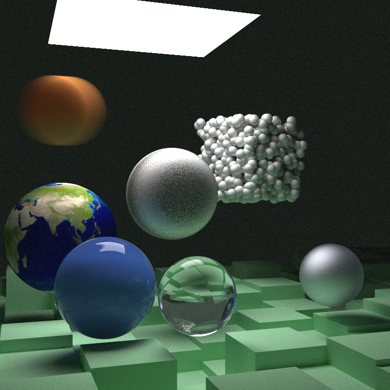

# Raytracer

Implementation of the ray-tracing in one weekend [book series](https://raytracing.github.io/) by Peter Shirley.

## Ray Tracing in One Weekend

[_Ray Tracing in One Weekend_](https://raytracing.github.io/books/RayTracingInOneWeekend.html)

### Final render

## Ray Tracing: The Next Week

[_Ray Tracing: The Next Week_](https://raytracing.github.io/books/RayTracingTheNextWeek.html)

### Final render

## Usage instructions

Install [mage](https://magefile.org/) with Homebrew using `brew install mage`.

### Targets

- `build` - Runs `go mod download` and then builds the `raytracer` binary.
- `clean` - Removes the generated PNG image from disk.
- `install:deps` - Installs all system and Go dependencies.
- `run` - Runs the `raytracer` binary, building it first if necessary.
- `test` - Runs the unit tests.
- `view` - Displays the generated image, generating it first if necessary.
